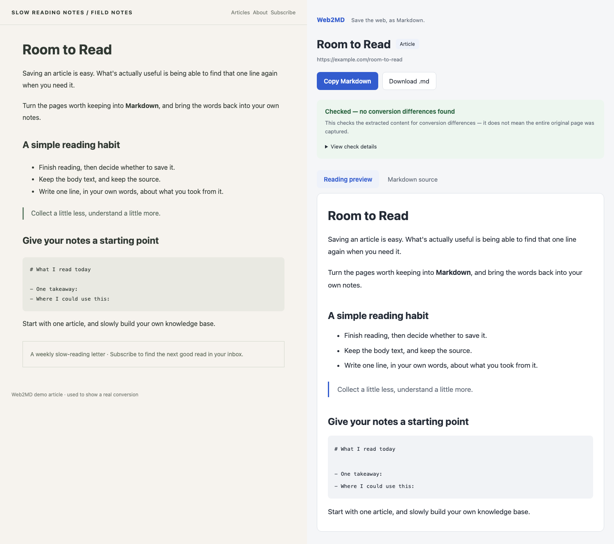

# Web2MD

### Save the web, as Markdown.

One click turns a page's article into Markdown, ready for your notes or reading list. After conversion, it checks the text and common elements and tells you exactly what — if anything — didn't make it through.

**Free · Converts locally · Copy or download in one click**

*Actual screenshot from converting the [demo article](docs/example.html) in this repo. Article mode drops the nav and subscribe bar, keeping the article's structure.*

## From page to notes

1. **Open the article, click the extension icon.** Web2MD finds the article body and converts it automatically.
2. **Preview the result, check the content report.** Any differences are called out directly; expand for the full counts.
3. **Copy the Markdown, or download the `.md` file.** Save it to your notes or wherever you keep things.

Use **Article mode** (the default) when you just want the article. Need the nav, footer, and everything else too? Right-click the page and choose **Convert full page to Markdown**.

## Installing in Chrome

For now this installs as an unpacked extension — no build step required.

1. On this repo's page, click **Code → Download ZIP** and unzip it somewhere you'll keep it (or just use your existing git clone).
2. In Chrome, go to `chrome://extensions` and turn on **Developer mode** (top right).
3. Click **Load unpacked** and select the folder containing `manifest.json`.
4. Pin **Web2MD** from the extensions menu in your toolbar, open an article, and click it to convert.

## What does the content check actually check?

It compares what was extracted from the page against the generated Markdown — headings, paragraphs, list items, links, images, captions, code blocks, table counts, and normalized text.

- **No differences found:** shows a short summary by default; expand to see the counts.
- **Differences found:** the affected checks are shown directly, with specifics you can trace, and the details expand automatically.
- **Unsupported content:** noted explicitly when detected — e.g. iframes, audio/video, canvas, and inline SVG.

A passing check doesn't mean the entire original page was captured — article detection can miss sections, and content that hasn't loaded yet can't be checked either. For anything that matters, cross-check against the original page.

## A few things worth knowing before you use it

- Built-in browser pages (`chrome://` etc.) can't be converted.
- To convert `file://` pages, enable **Allow access to file URLs** on the extension's details page.
- Scroll through the page first and let lazy-loaded content and images appear before converting. Markdown keeps image URLs — it doesn't bundle images into an offline file.
- Content inside iframes, canvas, closed shadow DOM, anything not yet loaded or not currently accessible, and inline SVG source code are not converted.
- The reading preview supports common Markdown structures; for anything more complex, check the **Markdown source** view too.
- Old results may become unreadable after the extension reloads or the browser restarts — copy or download promptly if you need to keep them.

## Development and testing

The core logic has zero dependencies and no build step; the extension entry points are kept separate from the conversion logic.

| Location | Purpose |
| --- | --- |
| `core/` | Article detection, Markdown conversion, and content checks |
| `background.js` / `content.js` | Trigger conversion, read the page, pass along the result |
| `ui/` | Reading preview, check details, copy and download |
| `tests/` | Self-contained core tests that run directly in the browser |

Open `tests/run.html` in Chrome — it should show **ALL PASS**, no server needed. Tests cover counts, article vs. full-page mode, article detection, truncation-induced differences, summaries, and serialization determinism.

Article detection prefers a trustworthy `<main>` when present, otherwise falls back to heuristic scoring of candidate containers. Article mode skips nav, sidebars, footers, and similar regions; visible `aria-hidden` text is still kept, so letter-by-letter animated headings aren't lost.
